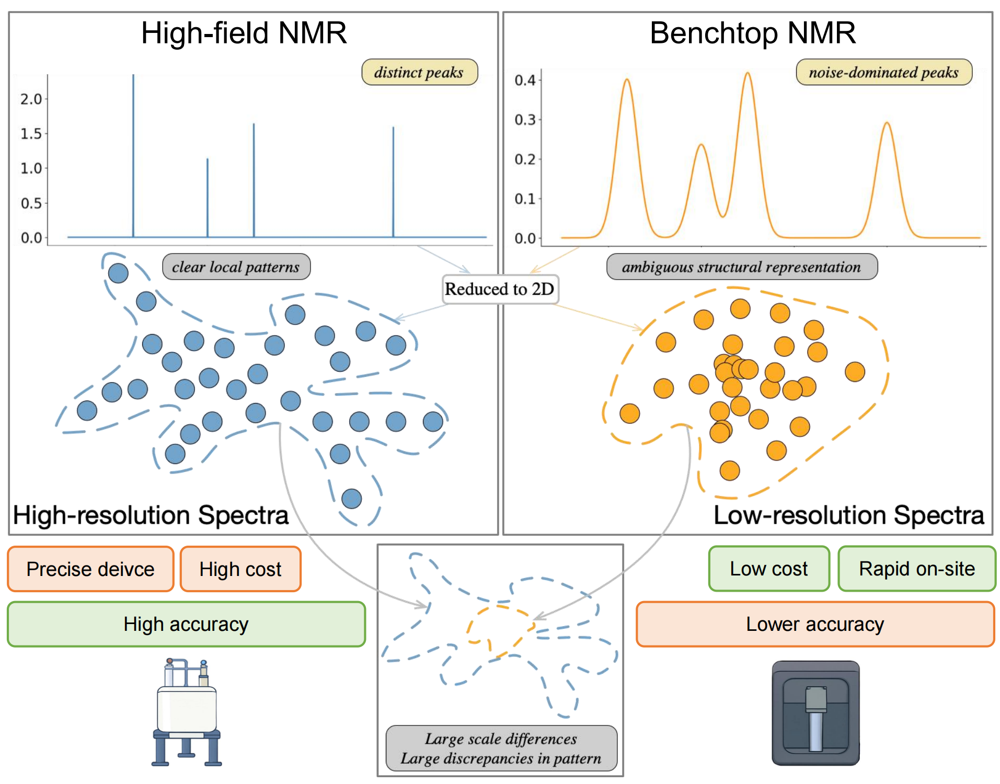
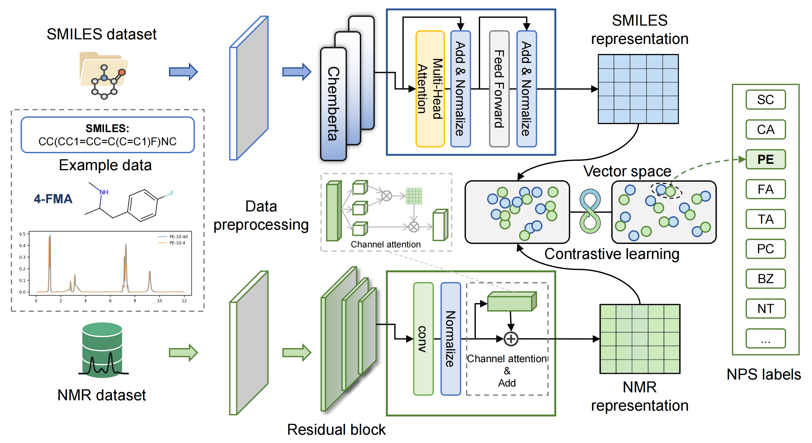

# NMR2NPS: Deep Learning for Benchtop NMR-based NPS Detection

An open-source deep learning framework (NMR2NPS) for **accurate and robust detection of new psychoactive substances (NPS)** using **benchtop NMR spectra**.  

---

## 📖 Background and Motivation

Benchtop nuclear magnetic resonance (NMR) devices enable rapid on-site detection of new psychoactive substances (NPS) at customs or mobile checkpoints, addressing the urgent need for **real-time screening in combating illicit drug trafficking**.  
However, portable NMR systems typically exhibit **low signal-to-noise ratios**, which severely limits the reliability of traditional spectral analysis methods.  

  

*Figure 1. Motivation: challenges of benchtop NMR for NPS detection and the opportunity for deep learning solutions.*

---

## 🚀 Our Approach: NMR2NPS

We introduce **NMR2NPS**, the **first deep learning model designed for benchtop NMR-based NPS detection**, explicitly addressing challenges such as low signal-to-noise ratios and limited data availability.  
The model leverages **contrastive pretraining with SMILES encodings**, combined with supervised fine-tuning, to enhance molecular feature representation. This design significantly improves classification accuracy for both **single-compound detection** and **mixture analysis**.

  

*Figure 3. Overview of the NMR2NPS architecture integrating contrastive learning, CNN feature extraction, and supervised fine-tuning for robust NPS classification.*

---

## 📂 Repository Structure
├── CL_train_data_sample.xlsx   # Sample dataset for contrastive learning pretraining
├── SFT_data_sample.xlsx        # Sample dataset for supervised fine-tuning
├── model_train.py              # Training code for NMR2NPS
└── mix_cases_inference.py      # Inference script for mixture detection

⚠️ **Note:** To access the **full dataset** used in our study, please visit:  
👉 [Complete Dataset Link](XXX)  

